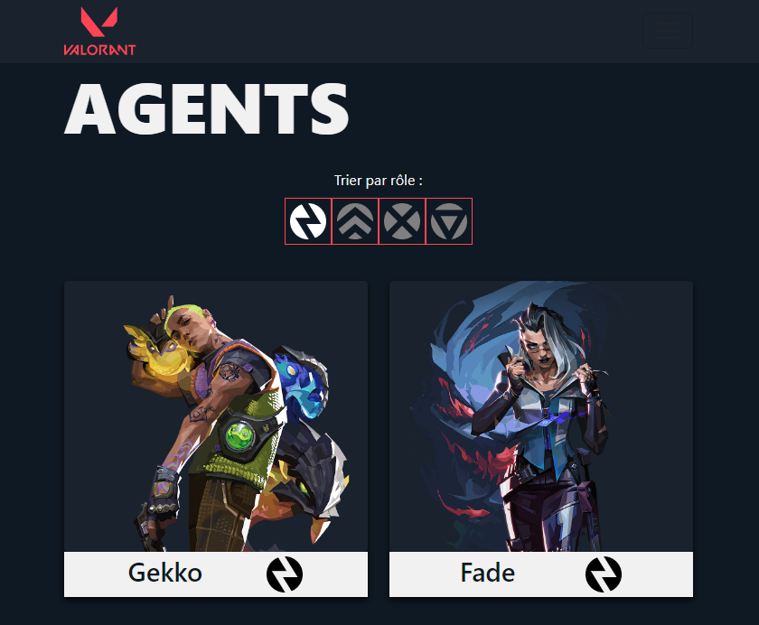

# Utilisation d'une Api pour présenter Valorant


## Contexte
Dans le cadre de mon apprentissage de JavaScript, j’ai réalisé un projet de présentation du jeu Valorant.
Mon objectif était d’afficher les données pour les cartes du jeu, les agents et les armes.

## Développement
J’ai donc réalisé une page d’accueil simple avec une redirection vers chacune de mes pages qui affichent les données que je souhaite.
J’ai donc créé une fonction pour récupérer les données de l’API en format JSON.

```
async function afficherAgents(){
    let response = await fetch('https://valorant-api.com/v1/agents?language=fr-FR');
    response = await response.json();
    return response;
}
let response = await afficherAgents();
let data = response.data;
```

Une fois les données récupérées, je crée une boucle pour créer une div dans le but d’afficher une card pour chacun de mes agents, par exemple.
Le processus est le même pour chacune des pages.
Pour la page des armes et des agents, j’ai créé un filtre permettant d’afficher mes données par types.
J’ai aussi ajouté une page pour afficher le détail d’un agent lorsque que l’on clique sur celui-ci dans la liste.
Pour cela, j’ai ajouté l’id de l’agent dans les paramètres de la fonction pour récupérer les données.

## Conclusion
Je me suis beaucoup investis sur le front-end du projet afin de rendre la site le plus agréable possible.


